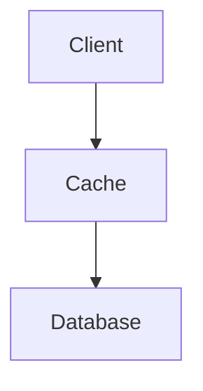

Distributed Cache é um cache compartilhado entre vários servidores.

Seu objetivo é reduzir a carga sobre bancos de dados e diminuir a latência.

> [!tip]
> O cache deve armazenar apenas dados que possam ser reconstruídos.

## Benefícios

- Alta performance
- Escalabilidade
- Menor custo
- Menor latência

## Tecnologias

- Redis
- Memcached
- Hazelcast

## Veja também

- [[Caching]]
- [[Redis]]
- [[Performance]]