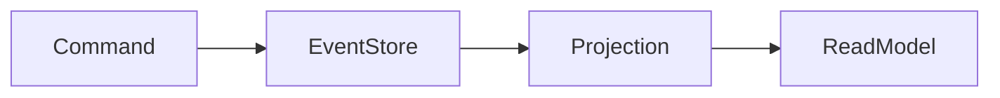

Event Sourcing é um padrão onde o estado da aplicação é reconstruído a partir da sequência de eventos ocorridos.

Em vez de armazenar apenas o estado atual, armazenam-se todos os eventos.

> [!info]
> O histórico completo da aplicação fica preservado.

## Benefícios

- Auditoria
- Replay
- Rastreabilidade
- Integração por eventos

## Desafios

- Complexidade
- Evolução de eventos
- Projeções

## Veja também

- [[CQRS]]
- [[Event Driven Architecture]]
- [[Domain Events]]