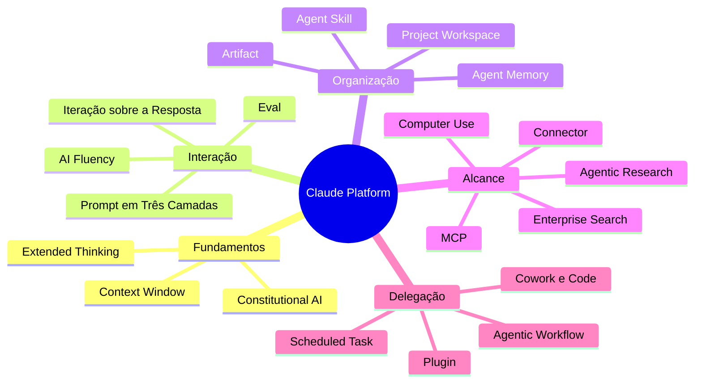

> [!abstract]
> Mapa do domínio **trabalho assistido por IA de propósito geral**, a partir da plataforma Claude: como se conversa com um assistente, como se organiza conhecimento e processo em torno dele, como se amplia seu alcance às ferramentas, e como se delega trabalho inteiro em vez de perguntas.

# Visão Geral

O domínio se organiza em cinco camadas. As três do meio são o que muda entre um uso amador e um uso fluente da IA.

# Fundamentos

O substrato: como o modelo é alinhado, quanto ele consegue considerar de uma vez, e quando vale fazê-lo pensar antes de responder.

- [[Constitutional AI]]
- [[Context Window]]
- [[Extended Thinking]]
- [[Large Language Model (LLM)]]

# Interação

A camada de competência humana. É aqui que a diferença de resultado entre duas pessoas usando a mesma ferramenta se explica.

- [[AI Fluency]] — as quatro competências do 4D Framework
- [[Prompt em Três Camadas]] — palco, tarefa, regras
- [[Iteração sobre a Resposta da IA]] — diagnóstico e correção
- [[Eval]] · [[Eval Leve de Tarefas com IA]] — medir se serve para *o seu* trabalho

# Organização do conhecimento e do processo

O que persiste entre conversas. A distinção estruturante: **projeto guarda conhecimento, skill executa processo, artifact é o produto**.

- [[Project Workspace]] · [[Configuração de Projeto de IA]]
- [[Agent Skill]] · [[Criação de Skill por Conversa]]
- [[Artifact]]
- [[Agent Memory]]
- [[Retrieval-Augmented Generation (RAG)]] — como o projeto escala além da janela

# Alcance às ferramentas e à informação

Tirar o assistente do isolamento da caixa de texto. O efeito não é resposta melhor — é **espaço de perguntas maior**.

- [[Connector]] — acesso a ferramentas externas
- [[Model Context Protocol (MCP)]] — o padrão por trás
- [[Enterprise Search]] — consulta unificada ao conhecimento da organização
- [[Agentic Research]] — investigação multi-etapa autodirigida
- [[Computer Use]] — o último recurso quando não há conector

# Delegação de trabalho

Entregar um resultado em vez de uma pergunta, e as superfícies onde isso acontece.

- [[Agentic Workflow]] — a forma
- [[Escolha da Forma de Trabalho com IA]] — como reconhecê-la antes de começar
- [[Claude Cowork]] · [[Claude Code]] — as superfícies
- [[Scheduled Task]] — a recorrência
- [[Plugin (AI Agent)]] — o empacotamento por papel
- [[Human-in-the-Loop]] — o controle que a delegação preserva

# Literatura

- [[Claude 101]] — curso da Anthropic Academy
  - [[Claude 101 01|Meet Claude]] · [[Claude 101 02|Organizando trabalho e conhecimento]] · [[Claude 101 03|Ampliando o alcance]] · [[Claude 101 04|Colocando tudo junto]] · [[Claude 101 05|Conclusão]]

# Pontes com outros clusters

| Ponte | Liga |
|---|---|
| [[Model Context Protocol (MCP)]] | Esta plataforma ao cluster de [[AI Generative Architecture\|arquitetura de IA generativa]] |
| [[Retrieval-Augmented Generation (RAG)]] | Organização de conhecimento à camada de recuperação |
| [[Human-in-the-Loop]] | Delegação à governança de IA do [[ITIL 5]] |
| [[Agentic AI]] · [[Multi-Agent Systems]] | Fluxo agêntico à arquitetura multiagente |
| [[Eval]] | Discernimento ao [[Service Validation and Testing]] do ITIL |
| [[Knowledge Management]] | [[Enterprise Search]] à prática ITIL de gestão do conhecimento |

# Perguntas de Pesquisa

> [!question] Lacunas conhecidas deste domínio
> - **Cowork em profundidade** — governança de permissões, limites de subagente, composição com skills e plugins. Fonte: curso *Introduction to Claude Cowork*.
> - **Claude Code em profundidade** — fluxos de desenvolvimento, modos de autonomia na prática. Fonte: curso *Claude Code in Action*.
> - **Anatomia técnica de uma Skill** — estrutura de diretório, frontmatter, carregamento progressivo. Falta fonte primária.
> - **Escrita de servidor MCP** — do lado do provedor, não do consumidor. Complementaria [[Model Context Protocol (MCP)]].
> - **Prompt injection e defesa em agentes** — mencionado de raspão em [[Computer Use]]; merece nota própria, com ponte para [[Threat Modeling]].
> - **Economia de tokens** — custo, cache de prompt, orçamento de contexto. Nada no vault sobre isso.
> - **Evals rigorosos** — o vault tem apenas o formato leve; falta o que se faz quando a decisão é cara.
