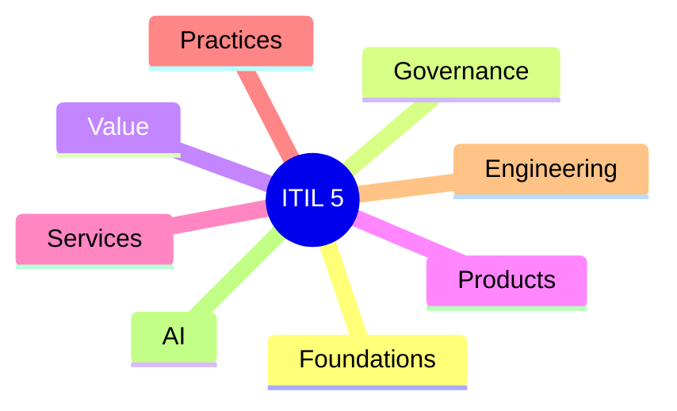

> [!abstract]
> Este MOC (Map of Content) organiza as notas permanentes relacionadas ao ITIL 5. O objetivo não é resumir o framework, mas servir como ponto central de navegação entre conceitos, práticas e relações com outras disciplinas da Engenharia de Software.

---

# Visão Geral

---

# Foundations

## Framework

- [[ITIL]]
- [[ITSM]]
- [[Digital Organization]]
- [[Digital Ecosystem]]
- [[Service Management]]
- [[Product and Service Management]]

---

## Core Concepts

- [[Value]]
- [[Value Co-Creation]]
- [[Service]]
- [[Product]]
- [[Service Offering]]
- [[Service Relationship]]
- [[Service Consumer]]
- [[Service Provider]]
- [[Stakeholder]]
- [[Outcome]]
- [[Output]]
- [[Cost]]
- [[Risk]]
- [[Utility]]
- [[Warranty]]

---

# Service Value System (SVS)

- [[Service Value System]]
- [[Guiding Principles]]
- [[Governance]]
- [[Continual Improvement]]
- [[Practices]]
- [[Service Value Chain]]

---

# Service Value Chain

- [[Plan]]
- [[Improve]]
- [[Engage]]
- [[Design and Transition]]
- [[Obtain or Build]]
- [[Deliver and Support]]

---

# Service Value Streams

- [[Service Value Stream]]
- [[Value Stream]]
- [[Flow]]
- [[Feedback Loop]]
- [[Value Stream Mapping]]
- [[Lead Time]]
- [[Cycle Time]]

---

# Guiding Principles

- [[Focus on Value]]
- [[Start Where You Are]]
- [[Progress Iteratively with Feedback]]
- [[Collaborate and Promote Visibility]]
- [[Think and Work Holistically]]
- [[Keep It Simple and Practical]]
- [[Optimize and Automate]]

---

# Governance

- [[Governance]]
- [[Strategy]]
- [[Policy]]
- [[Decision Making]]
- [[Compliance]]
- [[Risk Management]]

---

# Products

- [[Product]]
- [[Digital Product]]
- [[Product Management]]
- [[Product Owner]]
- [[Product Strategy]]
- [[Product Roadmap]]
- [[Product Lifecycle]]
- [[Product Discovery]]
- [[Product Delivery]]

---

# Services

- [[Service Design]]
- [[Service Transition]]
- [[Service Operation]]
- [[Service Continuity]]
- [[Service Catalog]]
- [[Service Portfolio]]

---

# Experience

- [[Experience]]
- [[Customer Experience]]
- [[User Experience]]
- [[Employee Experience]]
- [[Experience Management]]

---

# Continual Improvement

- [[Continual Improvement]]
- [[Improvement Model]]
- [[Metrics]]
- [[KPIs]]
- [[Value Measurement]]

---

# Practices

## General Management

- [[Architecture Management]]
- [[Continual Improvement Practice]]
- [[Knowledge Management]]
- [[Measurement and Reporting]]
- [[Organizational Change Management]]
- [[Portfolio Management]]
- [[Project Management]]
- [[Risk Management]]
- [[Strategy Management]]

---

## Service Management

- [[Availability Management]]
- [[Capacity and Performance Management]]
- [[Change Enablement]]
- [[Configuration Management]]
- [[Incident Management]]
- [[IT Asset Management]]
- [[Monitoring and Event Management]]
- [[Problem Management]]
- [[Release Management]]
- [[Service Configuration Management]]
- [[Service Continuity Management]]
- [[Service Desk]]
- [[Service Level Management]]
- [[Service Request Management]]

---

## Technical Management

- [[Deployment Management]]
- [[Infrastructure and Platform Management]]
- [[Software Development and Management]]

---

# Engineering

- [[Agile]]
- [[Lean]]
- [[DevOps]]
- [[DevSecOps]]
- [[Platform Engineering]]
- [[Site Reliability Engineering]]
- [[Continuous Delivery]]
- [[Continuous Integration]]
- [[Infrastructure as Code]]
- [[Observability]]

---

# Architecture

- [[Enterprise Architecture]]
- [[TOGAF]]
- [[Business Capability]]
- [[Capability Mapping]]
- [[Domain Driven Design]]
- [[Event Storming]]
- [[Team Topologies]]

---

# Data & AI

- [[Artificial Intelligence]]
- [[AI Enabled Organization]]
- [[AIOps]]
- [[AI Agents]]
- [[Knowledge Management]]
- [[Knowledge Graph]]
- [[RAG]]
- [[Autonomous Operations]]

---

# Métricas

- [[SLA]]
- [[SLO]]
- [[SLI]]
- [[Error Budget]]
- [[DORA Metrics]]
- [[MTTR]]
- [[Availability]]
- [[Reliability]]

---

# Estudos Comparativos

- [[ITIL vs DevOps]]
- [[ITIL vs COBIT]]
- [[ITIL vs TOGAF]]
- [[ITIL vs SRE]]
- [[ITIL vs Platform Engineering]]
- [[ITIL vs Scrum]]
- [[ITIL vs SAFe]]

---

# Casos Práticos

- [[ITIL em Organizações Orientadas a Produtos]]
- [[ITIL para Times Ágeis]]
- [[ITIL para DevOps]]
- [[ITIL para SRE]]
- [[ITIL para Platform Engineering]]
- [[ITIL e Inteligência Artificial]]

---

# Leituras Futuras

- [[PeopleCert ITIL 5]]
- [[ITIL Foundation]]
- [[ITIL Practice Guides]]
- [[ITIL Digital and IT Strategy]]
- [[ITIL High Velocity IT]]

---

# Perguntas de Pesquisa

> [!question]
>
> - O ITIL 5 é um framework de governança ou de gestão de serviços?
> - Como o Product Operating Model altera a aplicação do ITIL?
> - Quais práticas do ITIL são potencializadas por agentes de IA?
> - Como o Service Value System se relaciona com Team Topologies?
> - O SRE pode ser visto como uma implementação técnica dos objetivos operacionais do ITIL?
> - Como integrar TOGAF, DDD, DevOps e ITIL em uma arquitetura corporativa moderna?