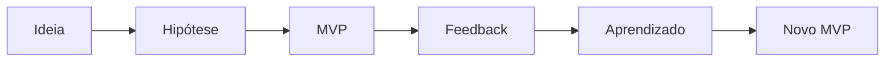

# Introdução

> [!abstract]
> Este capítulo apresenta a motivação da Lean Inception: reduzir riscos no desenvolvimento de produtos por meio da validação contínua de hipóteses, utilizando MVPs e colaboração entre diferentes áreas.

## Resumo Executivo

O desenvolvimento tradicional concentra análise, construção e entrega em um único ciclo longo, aumentando o risco de entregar um produto que não resolve o problema do usuário.

A Lean Inception propõe uma abordagem incremental, em que pequenas hipóteses são validadas continuamente através de MVPs.

O objetivo não é construir menos software, mas aprender mais cedo.

---

## Principais ideias

- Produtos são conjuntos de hipóteses.
- MVP serve para validar hipóteses.
- Aprender rapidamente reduz desperdícios.
- O produto evolui de MVP em MVP.
- Cada incremento deve gerar conhecimento.

---

## Conceitos apresentados

- [[MVP]]
- [[Hipóteses]]
- [[Entrega Contínua]]
- [[Validação de Hipóteses]]
- [[Produto Incremental]]
- [[Fatia Vertical]]
- [[Fator UAU]]

---

## Exemplos apresentados

- Ponte construída gradualmente
- Evolução do cortador de grama
- Facebook inicial
- Primeiro iPhone

---

## Minha interpretação

O maior aprendizado não é "entregar rápido", mas diminuir o custo do erro.

O MVP representa uma estratégia de aprendizagem contínua.

---

## Referências

- [[Lean Startup]]
- [[Continuous Delivery]]
- [[MVP]]

---

## Diagrama

---

## Insight do Arquiteto

Em arquiteturas modernas (DDD + Arquitetura Hexagonal + Microsserviços), um MVP normalmente corresponde a uma **fatia vertical** do domínio.

Isso permite:

- deploy independente;
- observabilidade desde a primeira versão;
- experimentação com baixo risco;
- evolução incremental da arquitetura.

Em ambientes AWS e Kubernetes, essa abordagem combina naturalmente com pipelines de CI/CD, feature flags e deploy progressivo.