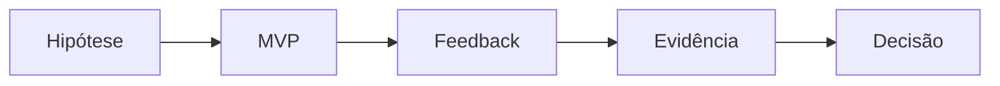

# Hipóteses

Uma hipótese representa uma suposição que precisa ser validada por meio de evidências reais.

## Objetivo

Transformar opiniões em conhecimento validado.

## Exemplo

> "Usuários utilizarão esta funcionalidade diariamente."

## Processo

## Relacionamentos

- [[MVP]]
- [[Validação de Hipóteses]]