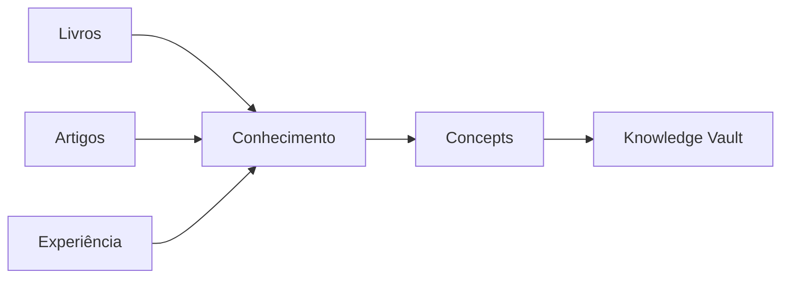
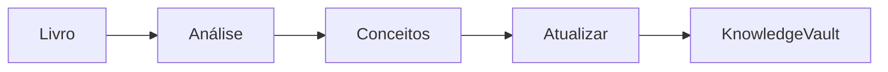

# 🧠 Engineering Knowledge Vault

> Uma base de conhecimento viva sobre Arquitetura de Software, Arquitetura Corporativa, Cloud, IA e Engenharia de Software, construída com Obsidian e evoluída continuamente com apoio de Inteligência Artificial.

## Objetivo

Este repositório organiza o conhecimento adquirido em livros, artigos, documentações técnicas e experiências práticas.

Em vez de armazenar apenas resumos, o objetivo é construir uma base de conhecimento permanente, onde cada novo estudo enriquece conceitos já existentes.

---

## Estrutura

```text
Knowledge Vault/

├── Books/
├── Concepts/
├── Knowledge/
├── Frameworks/
├── Patterns/
├── Battle Cards/
├── Flashcards/
├── Diagrams/
├── Templates/
├── References/
└── Glossary/
```

---

## Filosofia



Os livros são fontes.

Os conceitos são permanentes.

O conhecimento evolui continuamente.

---

## Princípios

### 🧩 Atomic Notes

Cada nota representa apenas um conceito.

Isso facilita o entendimento, a reutilização e a criação de conexões.

---

### 🌱 Evergreen Notes

As notas nunca estão concluídas.

Cada nova leitura ou experiência enriquece o conhecimento existente.

---

### 🕸️ Zettelkasten

As notas são conectadas entre si por meio de links.

O valor do Vault está nas conexões entre os conceitos.

---

### 📂 PARA

A organização do Vault é inspirada no método PARA, separando fontes, conhecimento permanente, referências e materiais de apoio.

---

### 🧠 Second Brain

O Vault funciona como um segundo cérebro.

Seu objetivo é reduzir a necessidade de memorizar informações e facilitar a recuperação do conhecimento quando necessário.

---

### 🤖 Curadoria Assistida por IA

A Inteligência Artificial auxilia na extração de conceitos, geração de diagramas, resumos, flashcards e conexões entre notas.

A curadoria final permanece humana.

---

## Fluxo de Trabalho



Cada novo material estudado fortalece uma base de conhecimento única, evitando duplicações e promovendo conexões entre conceitos.

---

> **Livros são temporários. Conceitos são permanentes. Conhecimento conectado gera valor.**