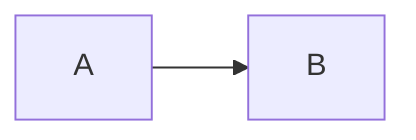
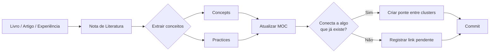

# 🧠 Engineering Knowledge Vault

> [!info]
> Base de conhecimento viva sobre **Arquitetura de Software, Arquitetura Corporativa, Cloud, IA Generativa e Engenharia de Software**, construída em Obsidian e evoluída continuamente com apoio de Inteligência Artificial.

Este repositório não é um repositório de resumos. Cada livro lido, artigo estudado ou experiência prática é **decomposto em conceitos atômicos permanentes** que se conectam entre si. O valor não está nas notas isoladas — está na rede que elas formam.

> **Livros são temporários. Conceitos são permanentes. Conhecimento conectado gera valor.**

---

## Índice

- [Filosofia](#filosofia)
- [Estrutura do Vault](#estrutura-do-vault)
- [Tipos de Nota](#tipos-de-nota)
- [Como uma Nota é Construída](#como-uma-nota-é-construída)
- [Conexões e Navegação](#conexões-e-navegação)
- [Recursos Utilizados](#recursos-utilizados)
- [Fluxo de Trabalho](#fluxo-de-trabalho)
- [Estado Atual](#estado-atual)
- [Trabalhando com Agentes de IA](#trabalhando-com-agentes-de-ia)
- [Convenções de Git](#convenções-de-git)

---

## Filosofia

O vault combina cinco princípios que definem tanto o que entra quanto como é escrito:

### 🧩 Atomic Notes

Cada nota representa **um único conceito**. Se uma nota precisa de dois títulos de primeiro nível para explicar coisas diferentes, são duas notas. Isso é o que permite reutilizar o mesmo conceito em contextos distintos sem duplicar conteúdo.

### 🌱 Evergreen Notes

Nenhuma nota está concluída. Uma nota sobre `Knowledge Graph` escrita ao estudar RAG será enriquecida meses depois ao estudar ontologias corporativas. O campo `status` no frontmatter registra em que ponto dessa maturação a nota está.

### 🕸️ Zettelkasten

As notas se conectam por links `[[wikilink]]`. Uma nota sem links de entrada nem de saída é um sintoma, não um resultado — significa que o conhecimento ficou órfão da rede.

### 📂 PARA

A organização em pastas numeradas separa **fonte** (de onde veio) de **conhecimento permanente** (o que ficou), de **navegação** (como encontrar) e de **aplicação** (onde foi usado).

### 🤖 Curadoria Assistida por IA

A IA auxilia na extração de conceitos, geração de diagramas, identificação de conexões e detecção de lacunas. **A curadoria final é sempre humana** — a IA propõe, o autor decide o que entra no vault.

---

## Estrutura do Vault

```text
Knowledge-Vault/
├── 01 Literature/              # Fontes: o que foi lido
│   └── Books/
│       └── <Nome do Livro>/
│           ├── <Nome do Livro>.md          # Índice do livro
│           ├── <Nome do Livro> 01.md       # Capítulo/Parte 1
│           └── <Nome do Livro> NN.md       # Capítulo/Parte N
│
├── 02 Permanent Notes/         # Conhecimento: o que ficou
│   ├── Concepts/               # O que uma coisa É
│   └── Practices/              # Como uma coisa é FEITA
│
├── 03 Maps of Content (MOCs)/  # Navegação: como encontrar
│
└── 04 Projects/                # Aplicação: onde foi usado
```

### O que vai em cada pasta

| Pasta | Papel | Regra de entrada |
|---|---|---|
| **01 Literature** | Notas de fonte, presas ao material original | Uma nota por capítulo/parte + um índice por obra. Nunca é reescrita depois — é o registro da leitura |
| **02 Permanent Notes/Concepts** | Conceitos atômicos, independentes da fonte | Só entra o que tem valor **fora** do livro que o originou. Deve fazer sentido sozinho, meses depois |
| **02 Permanent Notes/Practices** | Técnicas, dinâmicas, atividades executáveis | Descreve um *como fazer*: passos, regras, template. Se responde "o que é", é Concept |
| **03 Maps of Content** | Índices navegáveis por domínio | Um MOC por domínio de estudo. Não contém conhecimento novo — organiza o que existe |
| **04 Projects** | Aplicação prática, estudos de caso | Onde a teoria foi exercitada. Sempre referencia as práticas e conceitos usados |

> [!important] A separação Concept × Practice
> `MVP` é um **Concept** — define o que é um mínimo produto viável.
> `Canvas MVP` é uma **Practice** — descreve os 7 blocos que se preenche num workshop.
> A mesma leitura produz os dois, em notas separadas que se linkam.

---

## Tipos de Nota

Cinco tipos, declarados no campo `type` do frontmatter:

| `type` | Pasta | Propósito |
|---|---|---|
| `literature` | 01 Literature | Registro de leitura de um capítulo ou obra |
| `concept` | 02/Concepts | Um conceito atômico: o que é, como funciona, como se relaciona |
| `practice` | 02/Practices | Uma técnica ou atividade: passos, regras, template |
| `moc` | 03 MOCs | Mapa de navegação de um domínio |
| `project` | 04 Projects | Estudo de caso ou aplicação prática |

E três estados de maturidade, no campo `status`:

| `status` | Significado |
|---|---|
| `seed` | Rascunho. A ideia foi capturada mas ainda não está bem formada |
| `growing` | Em evolução. Conteúdo utilizável, mas com lacunas conhecidas ou links pendentes |
| `evergreen` | Madura. Autossuficiente, conectada, revisada. Continua aberta a enriquecimento |

> [!warning] Vocabulário em migração
> Notas antigas ainda usam variações herdadas de sessões anteriores. A equivalência canônica é:
> `permanent-note` → `concept` · `project-case` → `project` · `status: permanent` → `evergreen` · `status: moc` → `evergreen`

---

## Como uma Nota é Construída

### 1. Frontmatter — obrigatório em toda nota

Os oito campos são obrigatórios. Quando um campo não se aplica, ele fica presente e vazio, nunca ausente — isso mantém as consultas e o Dataview previsíveis.

```yaml
---
title: Context Graph
aliases:
  - Execution Context
  - Contextual Graph
tags:
  - ai
  - generative-ai
  - context
type: concept
status: evergreen
source: Agentic AI, GraphRAG, AI Agent Architectures
author: ChatGPT
created: 2026-07-17
---
```

| Campo | Conteúdo |
|---|---|
| `title` | Nome canônico do conceito. Igual ao nome do arquivo |
| `aliases` | Sinônimos, siglas e traduções. É o que faz `[[RAG]]` resolver para a nota completa |
| `tags` | Eixos temáticos transversais. Sempre `kebab-case`, sempre em inglês |
| `type` | Um dos cinco tipos acima |
| `status` | Maturidade da nota |
| `source` | Livro, artigo, spec ou documentação que originou a nota |
| `author` | Autor da fonte, ou o assistente de IA quando a nota nasceu de uma conversa |
| `created` | Data de criação, `YYYY-MM-DD` |

### 2. Anatomia por tipo de nota

**Nota de conceito** — a espinha dorsal do vault:

````markdown
> [!abstract]
> Definição em uma frase. Deve responder "o que é" sem depender de nada.

## Conceito
Explicação em prosa curta. Por que existe, que problema resolve,
como se distingue de conceitos vizinhos.

## Estrutura / Fluxo


## Características
Lista enxuta dos atributos que definem o conceito.

## Comparação
Tabela contrastando com o conceito mais facilmente confundido.

## Veja também
- [[Conceito Relacionado]]
````

**Nota de prática** — orientada à execução:

```markdown
Definição da atividade e do resultado que ela produz.

## Dinâmica / Passo a Passo
1. Passo objetivo
2. Passo objetivo

## Regras
As restrições que fazem a técnica funcionar.

## Exemplo
Aplicação concreta, quando existir.

---
Ref: [[Prática Relacionada]], [[Conceito Base]]
```

**Nota de literatura** — presa à fonte:

```markdown
## Resumo executivo
## Principais ideias
## Conceitos apresentados     ← cada um vira (ou linka) uma nota permanente
## Exemplos

---
Ref: [[Conceito Extraído]], [[Outro Conceito]]
```

**MOC** — só navegação:

```markdown
> [!abstract]
> O que este mapa organiza e para quem serve.

# Visão Geral
Diagrama Mermaid das camadas ou eixos do domínio.

# <Camada / Eixo>
- [[Nota]]
- [[Nota]]

# Perguntas de Pesquisa
> [!question]
> As lacunas conhecidas do domínio.
```

### 3. Nomenclatura de arquivos

- O nome do arquivo **é** o identificador da nota — é o que `[[...]]` resolve. Mudá-lo quebra links.
- Siglas ficam entre parênteses após o nome por extenso: `Model Context Protocol (MCP).md`. A sigla vai em `aliases`.
- Conceitos técnicos consagrados ficam em inglês (`Circuit Breaker`, `Data Lake`). Práticas e conceitos de método traduzidos ficam em português (`Sequenciador de Funcionalidades`, `Jornadas do Usuário`).
- Capítulos de livro: `<Livro> NN.md`, com `NN` zero-padded, garantindo ordenação natural.

---

## Conexões e Navegação

O vault tem três mecanismos de ligação, com propósitos distintos:

| Mecanismo | Onde | Para quê |
|---|---|---|
| `[[Link]]` inline no texto | Corpo da nota | Conexão semântica: o conceito é *usado* na explicação |
| Seção `## Veja também` | Fim de notas de conceito | Conceitos vizinhos que valem a próxima leitura |
| Linha `Ref: [[A]], [[B]]` | Fim de notas de prática e literatura | Rastreabilidade: de onde veio, o que consome |

### Regras de conexão

1. **Toda nota permanente precisa de pelo menos um link de entrada.** Notas órfãs só são alcançáveis pelo explorador de arquivos — na prática, deixam de existir.
2. **Todo conceito novo entra no MOC do seu domínio** no mesmo momento em que é criado. É o que evita conhecimento invisível.
3. **Links para notas inexistentes são permitidos e desejáveis** — sinalizam a próxima nota a escrever. Mas devem viver dentro de um cluster em construção ativa, não espalhados. Um MOC com centenas de links quebrados vira lista de desejos, não mapa.
4. **Sempre que dois clusters se tocam, construa a ponte.** É onde o Zettelkasten paga: `Lei de Conway` conectando arquitetura a Team Topologies, `Knowledge Graph` conectando IA a gestão do conhecimento.

---

## Recursos Utilizados

Todo o conteúdo é escrito em Markdown puro, legível fora do Obsidian, usando apenas recursos com suporte amplo:

### Markdown + Frontmatter YAML

Base de tudo. O frontmatter torna cada nota consultável por `type`, `status` e `tags`.

### Wikilinks e aliases do Obsidian

```markdown
[[Model Context Protocol (MCP)]]        → link direto
[[MVP|Mínimo Produto Viável (MVP)]]     → link com rótulo alternativo
[[RAG]]                                 → resolve via alias
```

### Callouts

Usados com semântica consistente, não decorativa:

| Callout          | Uso no vault                                  |
| ---------------- | --------------------------------------------- |
| `> [!abstract]`  | Definição de abertura da nota                 |
| `> [!info]`      | Esclarecimento factual                        |
| `> [!tip]`       | Recomendação prática                          |
| `> [!important]` | Distinção que costuma ser confundida          |
| `> [!warning]`   | Armadilha, risco ou anti-padrão               |
| `> [!quote]`     | Citação literal da fonte                      |
| `> [!question]`  | Lacuna aberta, pergunta de pesquisa           |
| `> [!success]`   | Leitura ou interpretação própria sobre o tema |

### Mermaid

Diagramas versionáveis em texto, renderizados tanto no Obsidian quanto no GitHub. Os tipos em uso:

- `flowchart` — arquiteturas e fluxos conceituais
- `graph` — hierarquias e composições
- `stateDiagram-v2` — máquinas de estado (ex: Circuit Breaker)
- `timeline` — evolução histórica e linhas do tempo (ex: RPO/RTO)
- `mindmap` — visão geral de domínios em MOCs
- `gantt` — agendas de workshop

### Tabelas comparativas

Recurso central do vault: sempre que um conceito é confundível com outro, uma tabela lado a lado resolve. Ex.: *Knowledge Graph × Context Graph*, *Data Lake × Data Warehouse*, *Harness × Agent Runtime*.

### Grafo do Obsidian

O grafo é a ferramenta de diagnóstico do vault. Nós isolados indicam notas órfãs; ilhas sem pontes indicam clusters que não conversam.

---

## Fluxo de Trabalho



1. **Capturar a fonte.** Uma nota por capítulo em `01 Literature`, com resumo, ideias e a lista de conceitos apresentados.
2. **Extrair os conceitos.** Cada conceito relevante vira uma nota atômica em `Concepts` ou `Practices`. Conceito que já existe é **enriquecido**, nunca duplicado.
3. **Registrar no MOC.** O conceito novo entra no mapa do seu domínio imediatamente.
4. **Conectar.** Preencher `Veja também` / `Ref:` e procurar ativamente pontes com clusters existentes.
5. **Revisar o grafo.** Verificar órfãos e links quebrados fora do cluster ativo.
6. **Commitar.** Notas novas e refatorações em commits separados.

---

## Estado Atual

**63 notas permanentes**, organizadas em quatro clusters temáticos:

| Cluster | Notas | Estado |
|---|---:|---|
| **Cloud, Dados e Resiliência** | 24 | Denso e internamente coerente — Storage (Block/File/Object), DR/BC/RPO/RTO, Data Lake/Warehouse/ETL/ELT, padrões distribuídos |
| **Lean Inception** | 24 | Completo — literatura (Paulo Caroli), 13 práticas de workshop, conceitos, MOC e estudo de caso |
| **IA Generativa e Agentes** | 9 | Núcleo maduro (LLM, RAG, Knowledge Graph, Context Graph, MCP, Harness, Agent Runtime, Supervisor) — faltam as notas da camada multiagente |
| **ITIL e Service Management** | 6 | Em construção inicial — MOC estruturado, notas fundacionais em andamento |

### Maps of Content

- [[AI Generative Architecture]] — arquiteturas de IA em cinco camadas: raciocínio, conhecimento, contexto, execução e colaboração
- [[ITIL 5]] — governança e gestão de produtos e serviços digitais
- [[Lean Inception MOC]] — workshop de definição de MVP

### Em construção

- Camada multiagente do cluster de IA: `Hierarquia de Agentes`, `Agentes Especialistas`, `Agentes Paralelos`, `Human-in-the-Loop`, `Ferramentas Compartilhadas`
- Fundações do ITIL: `Service Value System`, `Product and Service Management`, conceitos de valor e serviço
- Pontes entre clusters: arquitetura ↔ organização (Conway, Team Topologies), IA ↔ gestão do conhecimento
---
> [!quote]
> **Livros são temporários. Conceitos são permanentes. Conhecimento conectado gera valor.**
